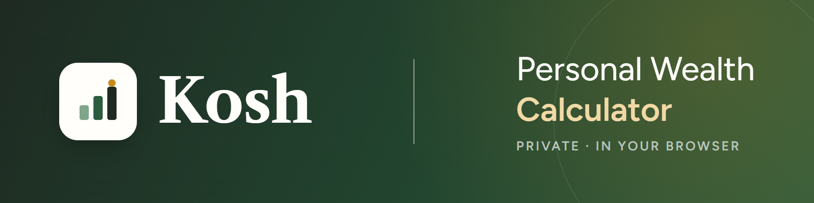
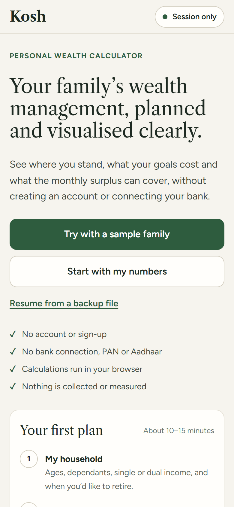
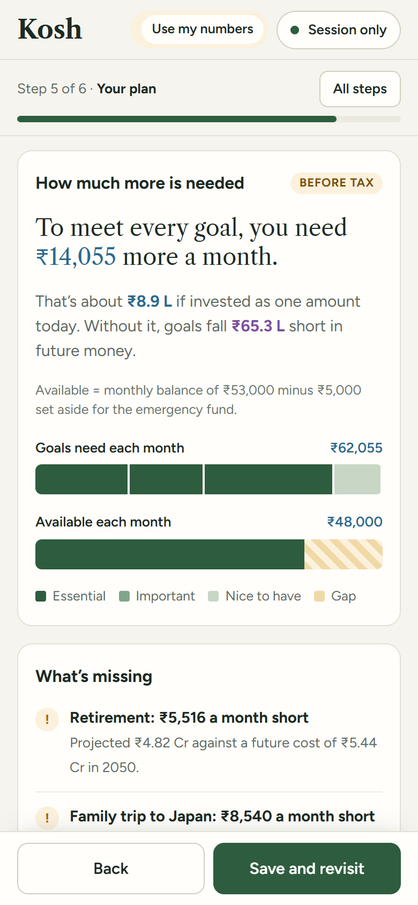
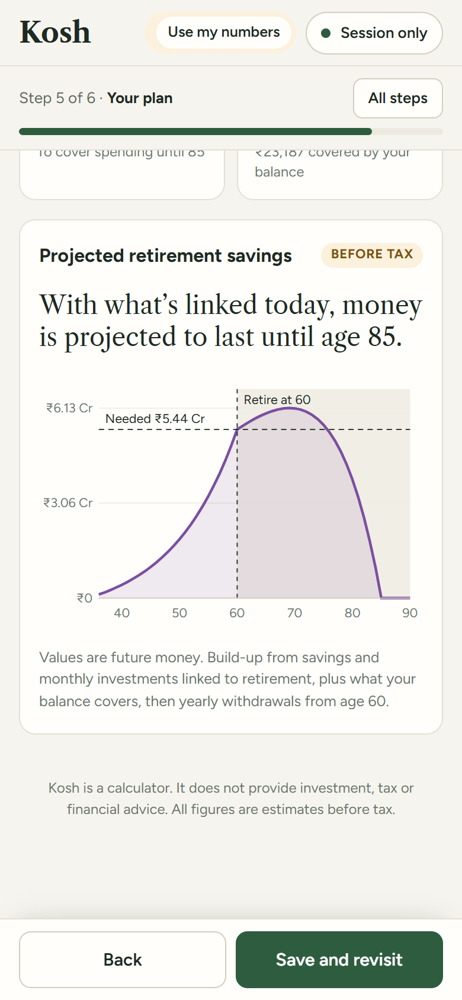

<p align="center">
  <a href="https://jacinthpaul.github.io/kosh/"></a>
</p>

<p align="center">
  <a href="https://jacinthpaul.github.io/kosh/"><b>Try it live</b></a> •
  <a href="#features">Features</a> •
  <a href="docs/sample-report.pdf">Sample report</a> •
  <a href="#privacy">Privacy</a> •
  <a href="#coming-soon">Coming soon</a> •
  <a href="#develop">Develop</a> •
  <a href="LICENSE">License</a>
</p>

<p align="center">
  <a href="https://github.com/jacinthpaul/kosh/actions/workflows/deploy.yml"></a>
  
  
  
  
  
  <a href="LICENSE"></a>
</p>

<p align="center">
  
  
  
  
</p>

---

**Kosh** is a self-service wealth calculator for Indian families. Enter your household, monthly money, savings and goals. Kosh shows your monthly balance, what each goal will cost, how much more you need, what’s missing, and the options you have. There's no account, no bank connection, and your numbers never leave your device.

<p align="center">
  
  &nbsp;
  
  &nbsp;
  
</p>

## Features

| Step | What you do |
|---|---|
| **1 · You and your goals** | Family, when you’d like to retire and what you’ll need, plus goals like education, a home or travel |
| **2 · Monthly money** | Income, regular spends, EMIs, monthly investments (SIPs, stocks, crypto, EPF, NPS, PPF…) linked to goals, and health and life insurance. Ends with your **monthly balance** |
| **3 · Yearly and one-time** | Bonuses and yearly spends like school fees, plus one-off income (a maturity, a sale) or spends in a given year |
| **4 · What I have and owe** | Savings, investments, property and loans at today’s value, each linked to what it’s for |
| **5 · Your plan** | **How much more is needed** each month, **what’s missing** (shortfalls, emergency fund, insurance, unlinked money), **options to explore** with their effect on the gap, and **your current mix** of equity, debt, gold and property |
| **6 · Download and save** | A **PDF report** (A4, 7 sections) that explains every number in plain words, with an option to hide names; plus an editable backup file (optionally password-encrypted), or save on this device |

**Grounded in practice:** the model follows the NSE Academy (NCFM) Wealth Management module wherever it applies:
- Goals up to 3 years away assume a safer return, and goals 7+ years away the full return.
- EMIs count toward goals once the loan ends.
- Surplus savings on one goal carry forward to the next.
- The emergency fund covers needs, not wants.

Its worked examples are reproduced exactly in the tests.

**Colour code:** 🔵 blue is today’s money, 🟣 plum is future money after price rises or growth, used the same way on every screen.

Try it with the built-in **sample family** to see a complete plan in one click, or see a **[sample PDF report](docs/sample-report.pdf)** for that family.

## Privacy

- **No backend.** All calculations run in your browser.
- **Nothing is collected or measured.** No analytics, no tracking, no error reporting. Fonts are self-hosted.
- **Enforced, not just promised.** The page's Content Security Policy blocks every request to a server after the page loads. The only allowances are `connect-src data:` and `'wasm-unsafe-eval'`, which let the PDF engine load its built-in WebAssembly. The PDF is generated on your device, with fonts embedded.
- **You decide what's kept.** Plans are saved only if you turn on *Save on this device*, or download a backup file (AES-GCM 256, PBKDF2-SHA256 with 200k iterations when you set a password).

> [!NOTE]
> **Not advice.** Kosh is a calculator that helps you visualise your finances so you can plan better. It shows figures, not recommendations, and does not provide investment, tax or financial advice. Figures are estimates and may contain errors; Kosh and its makers accept no responsibility or liability for any loss or decision made using it.

> [!IMPORTANT]
> **Open assumption: tax.** All figures are **before tax**. Tax on interest, capital gains and withdrawals is not modelled yet. This is shown clearly in the app and is still to be decided.

## Coming soon

- [ ] Stress test: lower returns, higher inflation, lower income, retiring earlier
- [ ] Interactive “What if…” sliders to combine several options
- [ ] Life timeline showing when goals arrive and family ages
- [ ] Tax-aware estimates
- [ ] Separate retirement timeline for a partner
- [ ] Install on your phone and use offline

## Develop

```bash
npm install
npm run dev      # local dev server
npm test         # engine + backup tests
npm run build    # static build in dist/
```

**Project layout**

| Path | What's there |
|---|---|
| `src/engine/` | Pure calculation model (`calc.ts`), ported from the design prototype and checked against its sample-family results |
| `src/storage/` | Save on this device, backup export/import, checks and clean-up for loaded files |
| `src/steps.tsx` · `src/explore.tsx` · `src/App.tsx` | Mobile-first UI |

**Deploy:** every push to `main` runs the tests, builds, and deploys to GitHub Pages via [`.github/workflows/deploy.yml`](.github/workflows/deploy.yml).

## License

[MIT](LICENSE)
